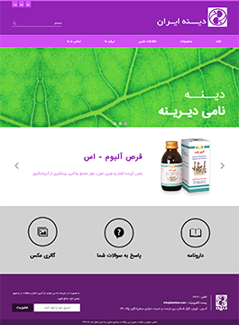
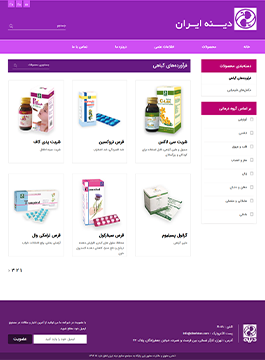
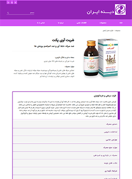
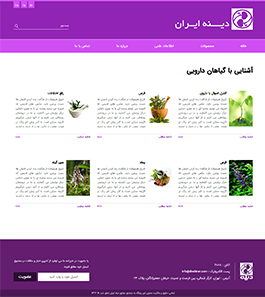
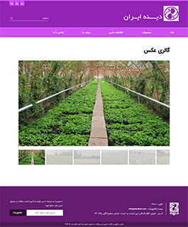
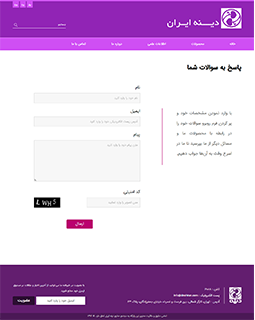

# Dineh Pharmaceutical Website Screenshots

Responsive website design project for **Dineh**, one of Iran's leading pharmaceutical companies, focused on delivering a modern, responsive user-friendly interface. Below are screenshots showcasing the key sections of the site.

---

## Screenshots

### Home

### Product Collection

### Product Details

### Info

### Gallery

### Contact

